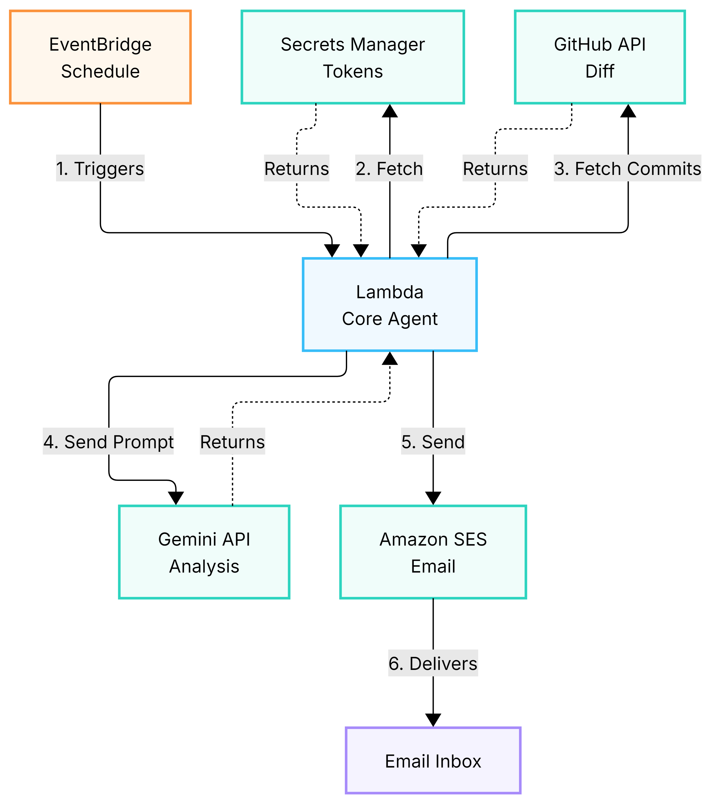
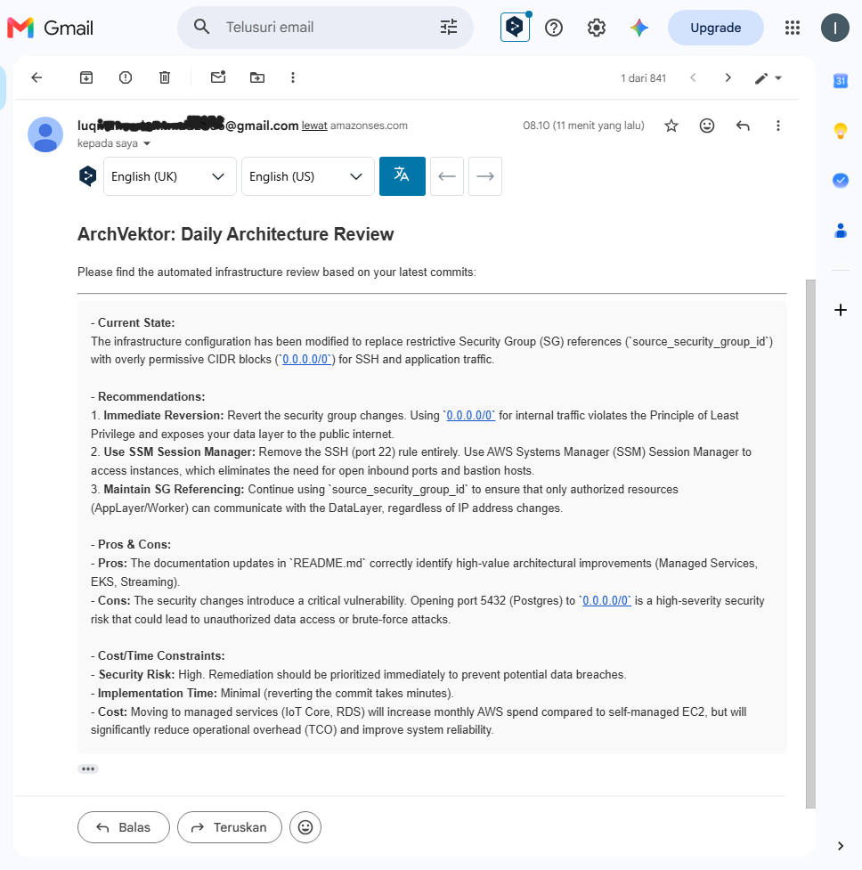

# ArchVektor: Always-On AI Architecture Reviewer ⚙️

**ArchVektor** is an autonomous, serverless AWS agent designed for the **AWS Builder Weekend Challenge**. It automatically reviews your daily infrastructure-as-code (IaC) commits and provides architectural recommendations directly to your inbox, adhering to the **AWS Well-Architected Framework**.

## Vision & Features
Modern cloud engineering often sacrifices architectural best practices for deployment speed. ArchVektor serves as a tireless senior architect that monitors your codebase every night.

- **100% Serverless & Zero Idle Cost**: Built natively on AWS Lambda and EventBridge. You only pay for the execution seconds.
- **Automated AI Review**: Fetches the last 24 hours of Git commits and evaluates the diff using the Gemini 3.1 Flash Lite API.
- **Zero-Dependency Architecture**: Uses pure Python 3.12 built-in libraries (`urllib`, `boto3`). No Lambda Layers required!
- **Email Reporting**: Sends a nicely formatted HTML report directly to your inbox via Amazon SES.

## Architecture

## Deployment Guide

### Phase 1: Prerequisites
1. **GitHub PAT**: Create a Personal Access Token in GitHub with `Read-Only` access to your repository.
2. **Gemini API Key**: Get a free API key from Google AI Studio.
3. **AWS Secrets Manager**: Create two `Plaintext` secrets (do NOT use Key/Value pairs):
   - `github-token-archvektor-v2` (Paste your GitHub PAT)
   - `gemini-api-key-archvektor-v1` (Paste your Gemini API Key)
4. **Amazon SES**: Verify your sender and recipient email addresses in the SES Console.

### Phase 2: AWS Lambda Setup
1. Create a new **Python 3.12** Lambda function named `ArchVektor-Core`.
2. **IAM Role**: Attach the policies found in `iam_policy.json` to the Lambda execution role.
3. **Code**: Copy the contents of `lambda_function.py` into the Lambda editor and deploy.
4. **Configuration**:
   - Set the **Timeout** to **5 minutes**.
   - Add the following **Environment Variables**:
     - `GEMINI_SECRET_NAME`: Your Gemini API key
     - `GITHUB_SECRET_NAME`: Your Github PAT token
     - `GITHUB_REPO`: e.g., `username/repo`
     - `GITHUB_BRANCH`: `main` (or `staging`)
     - `SES_SENDER_EMAIL`: Your verified sender email
     - `SES_RECIPIENT_EMAIL`: Your verified recipient email

### Phase 3: Trigger & Test
1. In the Lambda console, click **Add trigger**.
2. Select **EventBridge (CloudWatch Events)**.
3. Create a new rule with a Schedule expression: `cron(0 19 * * ? *)` (This runs at 02:00 AM WIB / 19:00 UTC).
4. **Test it**: Make a new commit to your repository, wait for the cron schedule (or click "Test" manually), and check your email!

### 🎉 The Result
By the time you wake up, you will receive a comprehensive AI architectural review directly in your inbox:

