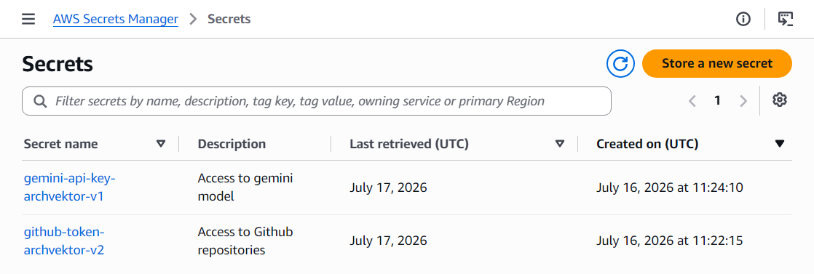
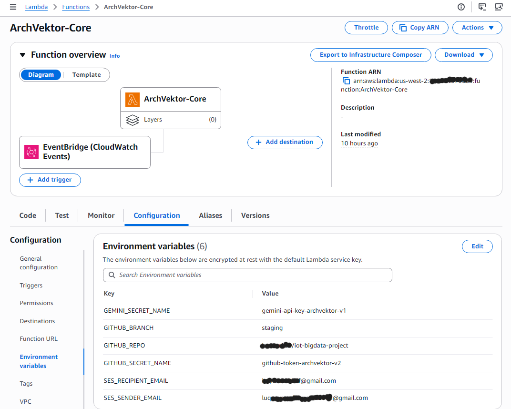
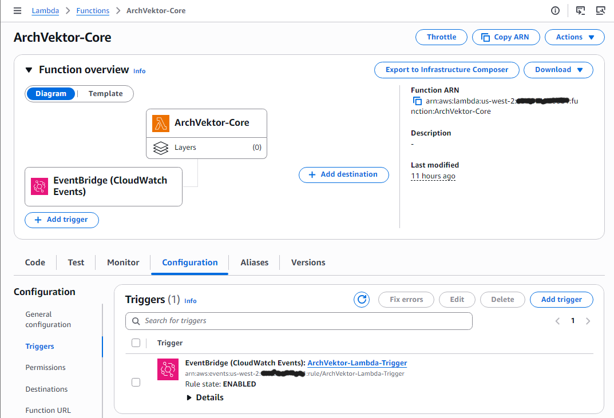

# 📸 ArchVektor Configuration Screenshots

This directory contains reference images for the ArchVektor deployment guide. If you are following the setup steps in the main documentation, you can refer to these screenshots to verify your configuration.

## 1. AWS Secrets Manager
Use `Plaintext` type for your secrets. Do not use Key/Value pairs.

## 2. AWS Lambda Environment Variables
Ensure all environment variables match exactly what your Lambda code expects.

## 3. Amazon EventBridge Trigger
Schedule the cron job to run daily (e.g., at `cron(0 19 * * ? *)`).

